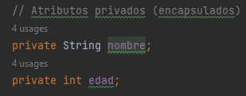

# PilaresPOO
INTEGRANTES:
- Hidalgo Paul
- Morales Gilmar
- Ruiz Erick

LOS CUATRO PILARES DE LA PROGRAMACIÓN ORIENTADA A OBJETOS:
- Abstracción:
  Al momento de convertir una entidad del mundo en un objeto de programación, existen muchas caracteristicas de dicha entidad,
  aqui es donde utilizaremos el concepto de abstracción, es decir, solo utilizar lo que necesitemos, en el caso de crear una
  clase Automovil, deberemos crear sus atributos, pero aun automovil posee muchos, por lo que solo usaremos los más basicos,
  Modelo, marca año, etc. dependiendo de lo que necesitemos implementar con esa clase.
  Ejemplo de JAVA:
  
  - Encapsulamiento: Consiste en ocultar los detalles internos de una clase y proporcionar una interfaz controlada para acceder y manipular los datos y comportamientos de dicha clase. En otras palabras, el encapsulamiento busca proteger los datos internos de una clase al limitar el acceso directo a ellos desde fuera de la misma, lo que promueve la modularidad y el control sobre cómo se utilizan los objetos.
  En POO, se definen atributos (variables) y métodos (funciones) en una clase. El encapsulamiento permite establecer niveles de visibilidad y acceso para estos atributos y métodos. Hay tres niveles principales de acceso:
  Public: Los miembros públicos de una clase son accesibles desde cualquier lugar, incluso desde fuera de la clase. No hay restricciones en su acceso. Se declaran usando la palabra clave public.
  Private: Los miembros privados son inaccesibles desde fuera de la clase. Solo pueden ser accedidos y modificados desde dentro de la misma clase. Se declaran usando la palabra clave private.
  Protected: Los miembros protegidos son similares a los privados, pero también son accesibles por las clases derivadas (subclases). Se declaran usando la palabra clave protected.
  
  
- Herencia: La herencia permite que una clase (subclase) herede atributos y métodos de otra clase (superclase). La herencia facilita la reutilización de código y la creación de jerarquías de clases.
En este ejemplo, tenemos una clase base llamada "figura", que tiene un atributo color y un método area() que devuelve el área de la figura. Luego, tenemos dos clases derivadas: "Circulo" y "Rectangulo", que heredan de la clase Figura con la palabra clave "extends".
La clase Circulo tiene un atributo adicional radio y sobrescribe el método area() para calcular el área de un círculo.
La clase Rectangulo tiene dos atributos adicionales, ancho y alto, y sobrescribe el método area() para calcular el área de un rectángulo. En este caso, la herencia nos permite reutilizar el código de la clase base (Figura) y extenderlo para crear clases más específicas (Circulo y Rectangulo) con atributos y comportamientos adicionales.

  
  
  

- Polimorfismo: El polimorfismo permite que objetos de diferentes clases sean tratados como objetos de una clase común a través de interfaces comunes. Esto se logra mediante la implementación de métodos con el mismo nombre en diferentes clases, pero con comportamientos específicos para cada una.
En este ejemplo, tenemos una clase base llamada Vehiculo con un atributo marcay un método hacerSonarBocina(). Luego, tenemos dos clases derivadas: Coche y Bicicleta, que heredan de la clase Vehiculo.
Cada una de las clases derivadas ( Coche y Bicicleta) sobrescribe el método hacerSonarBocina() para proporcionar su propio comportamiento específico. Cuando se llama al método hacerSonarBocina() en una instancia de Vehiculo, Java determina automáticamente qué versión del método debe ejecutarse según el tipo real del objeto.
Este es el concepto de polimorfismo: objetos de diferentes clases se pueden tratar de manera uniforme a través de una interfaz común ( Vehiculo en este caso), y el comportamiento específico se decide en tiempo de ejecución según el tipo real del objeto.

